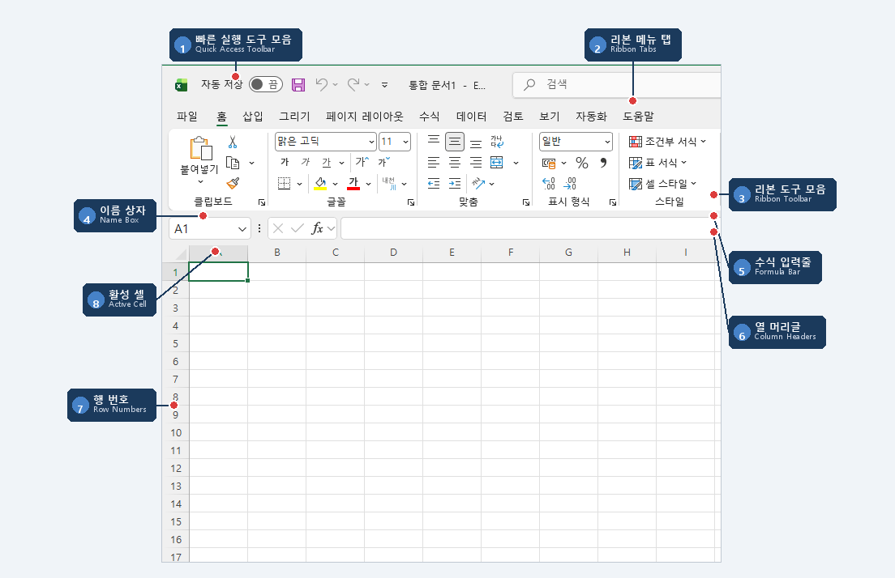
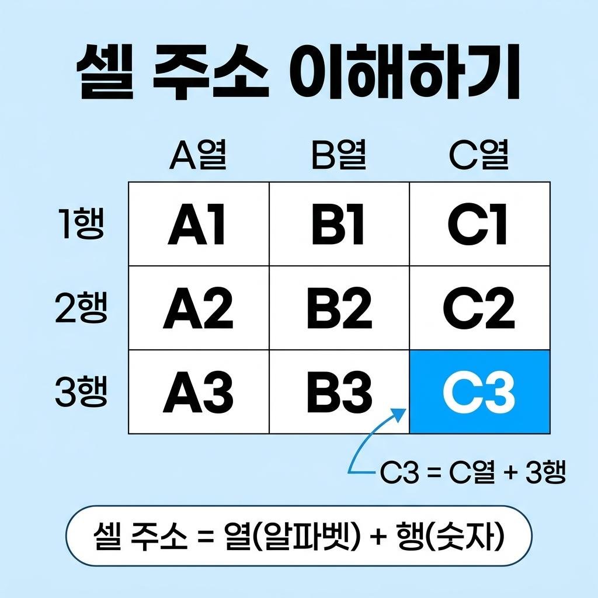

# 📌 1강: 엑셀 첫걸음 — 화면 구성 완벽 이해

> **핵심 포인트**: 엑셀 프로그램을 열고 화면 구성을 이해하며, 셀 주소의 개념을 익힙니다.

---

## 📖 이론 (20분)

### 엑셀이란?

엑셀(Excel)은 마이크로소프트가 만든 **스프레드시트(Spreadsheet)** 프로그램입니다.

> 스프레드시트 = "칸으로 나뉜 거대한 계산 종이"

엑셀로 할 수 있는 것들:
- 📊 데이터 정리 및 계산 (가계부, 성적표, 급여대장)
- 📈 차트와 그래프 만들기
- 🔍 대량 데이터 분석 (정렬, 필터, 피벗 테이블)
- 🤖 반복 업무 자동화 (매크로, 수식)
- 📋 깔끔한 보고서/문서 작성

### 엑셀 화면 구성

엑셀을 처음 열면 아래와 같은 화면이 나타납니다:

### 화면 구성 요소 상세

#### 1. 리본 메뉴 (Ribbon)
엑셀의 모든 기능이 모여 있는 곳입니다. 탭별로 구분되어 있어요.

| 탭 | 주요 기능 |
|----|----------|
| **홈** | 글꼴, 맞춤, 숫자 서식, 셀 편집 (가장 많이 사용) |
| **삽입** | 차트, 표, 그림, 도형 넣기 |
| **페이지 레이아웃** | 인쇄 설정, 여백, 방향 |
| **수식** | 함수 삽입, 이름 관리자 |
| **데이터** | 정렬, 필터, 유효성 검사 |
| **검토** | 맞춤법, 메모, 시트 보호 |
| **보기** | 화면 배율, 틀 고정, 창 정렬 |

> 💡 **팁**: 리본 메뉴가 너무 넓어 보이면 `Ctrl+F1`로 접었다 펼 수 있습니다!

#### 2. 이름 상자 (Name Box)
현재 선택한 셀의 **주소**를 보여줍니다. 직접 주소를 입력하여 원하는 셀로 바로 이동할 수도 있습니다.

#### 3. 수식 입력줄 (Formula Bar)
선택한 셀에 입력된 **내용**이나 **수식**을 보여줍니다. 여기서 직접 수정도 가능합니다.

#### 4. 셀 (Cell)
행과 열이 만나는 **한 칸**입니다. 엑셀의 가장 기본 단위!

### 셀 주소란?

엑셀에서 각 셀은 고유한 **주소(Address)**를 가집니다.

규칙은 아주 간단합니다:
- **열 이름(알파벳)** + **행 번호(숫자)** = 셀 주소
- 예: A열 1행 = `A1`, C열 3행 = `C3`, Z열 100행 = `Z100`

> 🔑 **열은 A~XFD** (총 16,384열), **행은 1~1,048,576** (약 104만 행)입니다.
> 하지만 걱정 마세요. 보통은 A~Z, 1~1000 범위면 충분합니다!

### 빠른 실행 도구 모음

화면 맨 위에 있는 작은 아이콘들입니다. 자주 쓰는 기능을 여기에 등록해두면 편합니다.

기본으로 포함된 것들:
- 💾 저장 (`Ctrl+S`)
- ↩️ 되돌리기 (`Ctrl+Z`)
- ↪️ 다시 실행 (`Ctrl+Y`)

### ⌨️ 이번 강의 필수 단축키

| 단축키 | 기능 |
|--------|------|
| `Ctrl+N` | 새 통합 문서 만들기 |
| `Ctrl+S` | 저장하기 |
| `Ctrl+Z` | 되돌리기 (실수해도 걱정 없어요!) |
| `Ctrl+Y` | 다시 실행하기 |
| `Ctrl+F1` | 리본 메뉴 숨기기/보이기 |

---

## 🔨 가이드 실습 (25분)

### 실습 1: 엑셀 열고 화면 탐색하기 (8분)

**목표**: 엑셀의 각 영역을 직접 눈으로 확인하고 클릭해봅니다.

1. **엑셀을 실행**합니다
   - Windows: 시작 메뉴 → "Excel" 검색 → 클릭
   - 또는 바탕화면의 Excel 아이콘 더블클릭

2. **"새 통합 문서"**를 클릭합니다 (빈 문서가 열립니다)

3. **각 영역을 확인**합니다:
   - 리본 메뉴의 각 탭(홈, 삽입, 수식 등)을 하나씩 클릭해보세요
   - 이름 상자에 표시된 셀 주소를 확인하세요 (처음에는 `A1`)
   - 수식 입력줄이 어디에 있는지 찾아보세요
   - 하단의 시트 탭을 확인하세요

4. **셀을 클릭**해봅니다:
   - `A1` 셀을 클릭 → 이름 상자에 `A1`이 표시되는지 확인
   - `D5` 셀을 클릭 → 이름 상자에 `D5`가 표시되는지 확인
   - `H10` 셀을 클릭 → 이름 상자에 `H10`이 표시되는지 확인

5. **이름 상자로 이동**해봅니다:
   - 이름 상자를 클릭하고 `Z100`을 입력 후 Enter → Z100 셀로 순간이동!
   - 다시 이름 상자에 `A1`을 입력 후 Enter → 처음으로 돌아오기

> ⚠️ **막힐 수 있는 포인트**:
> - **이름 상자 위치를 못 찾겠어요** → 수식 입력줄(fx) 왼쪽에 `A1`이라고 적힌 작은 칸입니다
> - **이름 상자에 입력 후 반응이 없어요** → 반드시 `Enter`를 눌러야 이동합니다. 그냥 클릭하면 안 돼요
> - **Z100으로 이동했는데 돌아오기 어려워요** → `Ctrl+Home`을 누르면 A1로 즉시 이동합니다

### 실습 2: 첫 데이터 입력하기 (10분)

**목표**: 셀에 데이터를 입력하고 간단한 표를 만들어봅니다.

아래 표를 직접 입력해보세요:

**따라하기 순서**:
1. `A1` 셀을 클릭하고 `이름`을 입력 → `Tab` 키를 누릅니다 (오른쪽으로 이동)
2. `B1` 셀에 `나이`를 입력 → `Tab` 키
3. `C1` 셀에 `취미`를 입력 → `Enter` 키 (다음 행 A열로 이동)
4. `A2` 셀에 `홍길동` 입력 → `Tab` → `25` 입력 → `Tab` → `독서` 입력 → `Enter`
5. 같은 방식으로 3행, 4행도 입력합니다

> 💡 **꿀팁**: `Tab`은 오른쪽, `Enter`는 아래로 이동합니다. 표를 입력할 때 아주 편리해요!

> ⚠️ **막힐 수 있는 포인트**:
> - **한글/영문 전환이 안 돼요** → `한/영` 키 또는 `Alt+Shift`로 전환하세요
> - **Tab을 눌렀는데 오른쪽이 아니라 다른 곳으로 가요** → 셀이 아닌 리본 메뉴가 선택된 상태일 수 있습니다. `Esc`를 누른 후 셀을 클릭하세요
> - **3행, 4행에 뭘 입력해야 할지 모르겠어요** → 아무 이름/나이/취미나 자유롭게 입력하면 됩니다 (예: 김철수, 28, 운동)

### 실습 3: 저장하고 다시 열기 (7분)

**목표**: 작업한 파일을 저장하고, 닫았다가 다시 열어봅니다.

1. **저장하기**: `Ctrl+S`를 누릅니다
   - 처음 저장하면 "다른 이름으로 저장" 대화상자가 나타납니다
   - 파일 이름: `내_첫_엑셀파일`로 입력
   - 저장 위치: 바탕화면이나 문서 폴더
   - "저장" 클릭

2. **파일 닫기**: `Ctrl+W` (또는 파일 → 닫기)

3. **다시 열기**: `Ctrl+O` (또는 파일 → 열기)
   - 방금 저장한 파일을 찾아 더블클릭
   - 입력한 데이터가 그대로 있는지 확인!

> 🔑 **중요**: 작업 중에 수시로 `Ctrl+S`를 눌러 저장하는 습관을 들이세요. 갑자기 꺼지면 다 날아갑니다!

> ⚠️ **막힐 수 있는 포인트**:
> - **저장 대화상자가 안 나타나요** → 이미 한 번 저장한 파일이면 바로 덮어쓰기됩니다. `F12`를 누르면 항상 "다른 이름으로 저장"이 나타납니다
> - **저장한 파일을 어디서 찾는지 모르겠어요** → 파일 → 열기 → "최근 항목"에서 방금 저장한 파일을 바로 찾을 수 있습니다
> - **파일을 닫았는데 엑셀 자체가 종료돼요** → `Ctrl+W`는 문서만 닫고, `Alt+F4`는 프로그램 전체를 종료합니다

---

## 🎯 자율 실습 (25분)

[TOPIC_POOL.md](TOPIC_POOL.md)에서 마음에 드는 주제를 골라 자유롭게 도전해보세요!

**이번 강의 추천 주제**: 🟢 나의 학급 출석부 만들기, 🟢 가족 연락처 표

---

## ✅ 이번 강의 체크리스트

- [ ] 엑셀이 무엇인지 이해했다
- [ ] 리본 메뉴, 이름 상자, 수식 입력줄의 위치를 알겠다
- [ ] 셀 주소의 규칙(열+행)을 이해했다
- [ ] 셀에 데이터를 입력하고 Tab/Enter로 이동할 수 있다
- [ ] 파일을 저장하고 다시 열 수 있다
- [ ] Ctrl+S, Ctrl+Z를 사용해봤다

---

## 🔗 다음 강의

[2강: 데이터 입력의 기초](../L02_데이터_입력의_기초/README.md) — 숫자, 문자, 날짜를 자유자재로 입력하기
