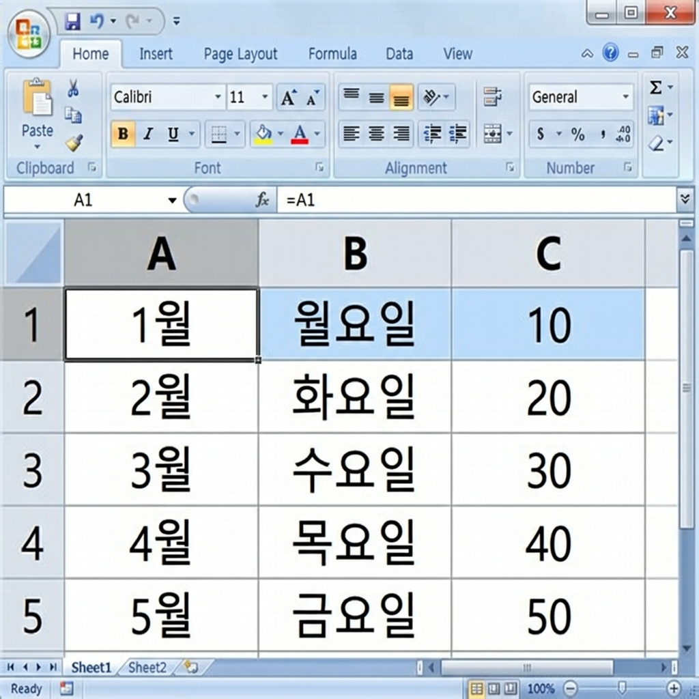

# 📌 2강: 데이터 입력의 기초 — 숫자, 문자, 날짜 마스터

> **핵심 포인트**: 엑셀이 인식하는 3가지 데이터 타입(숫자·문자·날짜)의 차이를 이해하고, 자동 채우기로 빠르게 데이터를 입력합니다.

---

## 📖 이론 (20분)

### 엑셀의 3가지 데이터 타입

엑셀에 입력할 수 있는 데이터는 크게 **3종류**입니다:

| 데이터 타입 | 예시 | 셀 내 정렬 | 특징 |
|------------|------|-----------|------|
| **숫자** | `100`, `3.14`, `-50` | 오른쪽 정렬 ➡️ | 계산 가능 |
| **문자(텍스트)** | `홍길동`, `서울시`, `abc` | 왼쪽 정렬 ⬅️ | 계산 불가 |
| **날짜/시간** | `2025-01-15`, `14:30` | 오른쪽 정렬 ➡️ | 내부적으로 숫자 |

> 🔑 **핵심**: 셀에 데이터를 입력한 후, **왼쪽 정렬**이면 문자, **오른쪽 정렬**이면 숫자라고 기억하세요!

### 숫자 입력 주의사항

```
✅ 올바른 숫자 입력        ❌ 잘못된 숫자 입력
   100                      100원  ← "원"이 붙으면 문자!
   3.14                     3,14   ← 쉼표가 아니라 점!
   -50                      (50)   ← 회계 형식은 별도 설정
   0.5                      1/2    ← 날짜로 인식될 수 있음
```

> ⚠️ **함정**: 전화번호 `01012345678`을 입력하면 앞의 `0`이 사라져 `1012345678`이 됩니다!
> 해결법: 셀에 먼저 **작은따옴표(`'`)**를 입력하고 번호를 쓰면 문자로 인식됩니다.
> 예: `'01012345678`

### 날짜 입력

엑셀이 인식하는 날짜 형식:

| 입력 | 엑셀 표시 | 인식 여부 |
|------|----------|-----------|
| `2025-01-15` | 2025-01-15 | ✅ |
| `2025/01/15` | 2025-01-15 | ✅ |
| `1/15` | 1월 15일 | ✅ (올해 기준) |
| `1월 15일` | 1월 15일 | ✅ |
| `25.1.15` | — | ❌ (문자로 인식) |

> 💡 **비밀**: 엑셀은 날짜를 내부적으로 **숫자**로 저장합니다. 1900년 1월 1일 = 1, 1900년 1월 2일 = 2, ...
> 그래서 날짜끼리 빼기가 가능합니다! (몇 일 차이인지 계산)

### 자동 채우기 (Auto Fill) ⭐

엑셀에서 가장 **시간을 절약**해주는 기능입니다!

#### 사용 방법
1. 셀에 데이터를 입력합니다
2. 셀 오른쪽 하단 모서리에 있는 **작은 사각형(채우기 핸들)**에 마우스를 가져갑니다
3. 마우스 포인터가 **+** 모양으로 바뀌면 아래로(또는 오른쪽으로) 드래그합니다

```
채우기 핸들 위치:

┌──────┐
│  A1  │
│      ■ ← 이 작은 사각형!
└──────┘
```

#### 자동 채우기 패턴 예시

| 시작값 | 자동 채우기 결과 |
|--------|----------------|
| `1` | 1, 1, 1, 1, 1 (복사) |
| `1`, `2` → 두 셀 선택 후 드래그 | 1, 2, 3, 4, 5 (연속) |
| `월` | 월, 화, 수, 목, 금, 토, 일 |
| `1월` | 1월, 2월, 3월, 4월, ... |
| `1분기` | 1분기, 2분기, 3분기, 4분기 |
| `2025-01-01` | 2025-01-01, 2025-01-02, ... |
| `제1회` | 제1회, 제2회, 제3회, ... |

> 🎵 **숫자 연속 채우기 팁**: 숫자 하나만 드래그하면 "복사"가 됩니다. **연속 숫자**를 원하면:
> - 방법 1: 두 셀에 `1`, `2`를 입력 → 두 셀을 선택 → 드래그
> - 방법 2: 하나만 입력 후 `Ctrl`키를 누른 채 드래그

### 셀 편집하기

이미 입력한 데이터를 수정하는 방법:

| 방법 | 설명 |
|------|------|
| 셀 더블클릭 | 셀 안에 커서가 들어가서 부분 수정 가능 |
| `F2` 키 | 같은 효과 — 셀 편집 모드 진입 |
| 수식 입력줄 클릭 | 수식 입력줄에서 직접 수정 |
| 셀 선택 후 바로 입력 | 기존 내용 **전체 덮어쓰기** |
| `Delete` 키 | 셀 내용 삭제 (서식은 유지) |

### ⌨️ 이번 강의 필수 단축키

| 단축키 | 기능 |
|--------|------|
| `Tab` | 오른쪽 셀로 이동 |
| `Enter` | 아래 셀로 이동 |
| `Shift+Tab` | 왼쪽 셀로 이동 |
| `Shift+Enter` | 위 셀로 이동 |
| `F2` | 셀 편집 모드 |
| `Delete` | 셀 내용 삭제 |
| `Ctrl+;` | 오늘 날짜 입력 |
| `Ctrl+D` | 위 셀 내용을 아래로 복사 (채우기) |

---

## 🔨 가이드 실습 (25분)

### 실습 1: 데이터 타입 구분하기 (8분)

**목표**: 숫자, 문자, 날짜를 입력하고 엑셀이 각각 어떻게 인식하는지 관찰합니다.

아래 표를 입력해보세요:

```
      A열              B열              C열
1행   입력값           정렬 방향        타입
2행   100              (관찰하세요)     (판단하세요)
3행   홍길동           (관찰하세요)     (판단하세요)
4행   2025-03-15       (관찰하세요)     (판단하세요)
5행   3.14             (관찰하세요)     (판단하세요)
6행   서울특별시       (관찰하세요)     (판단하세요)
7행   01012345678      (관찰하세요)     (판단하세요)  ← 주의!
8행   '01012345678     (관찰하세요)     (판단하세요)  ← 비교!
```

**관찰 포인트**:
- 7행과 8행의 차이를 주의 깊게 보세요. 앞의 `0`이 살아있나요?
- B열에는 직접 "왼쪽" 또는 "오른쪽"이라고 적어보세요
- C열에는 "숫자", "문자", "날짜" 중 하나를 적어보세요

### 실습 2: 자동 채우기 연습 (10분)

**목표**: 다양한 자동 채우기 패턴을 직접 체험합니다.

**📋 완성 결과 미리보기**:



새로운 시트에서 아래를 따라하세요:

1. **숫자 연속 채우기**
   - `A1`에 `1`, `A2`에 `2`를 입력
   - A1:A2를 선택 (A1부터 A2까지 드래그)
   - 채우기 핸들을 `A10`까지 드래그
   - ✅ 결과: 1, 2, 3, 4, 5, 6, 7, 8, 9, 10

2. **요일 채우기**
   - `C1`에 `월요일` 입력
   - 채우기 핸들을 `C7`까지 드래그
   - ✅ 결과: 월요일, 화요일, 수요일, ... , 일요일

3. **날짜 채우기**
   - `E1`에 `2025-01-01` 입력
   - 채우기 핸들을 `E31`까지 드래그
   - ✅ 결과: 1월 한 달 전체 날짜!

4. **월 채우기**
   - `G1`에 `1월` 입력
   - 채우기 핸들을 `G12`까지 드래그
   - ✅ 결과: 1월, 2월, ... , 12월

### 실습 3: 간단한 회원 명부 만들기 (7분)

**목표**: 배운 내용을 종합하여 실용적인 표를 만듭니다.

```
      A열        B열         C열          D열           E열
1행   번호       이름        가입일       연락처        등급
2행   1          김하나      2025-01-05   010-1234-5678 일반
3행   2          이두리      2025-02-14   010-2345-6789 VIP
4행   3          박세찬      2025-03-20   010-3456-7890 일반
5행   ...        ...         ...          ...           ...
```

- A열(번호)은 자동 채우기로 1~10까지 빠르게 입력
- C열(가입일)은 날짜 형식으로 입력
- 파일명 `회원명부`로 저장

---

## 🎯 자율 실습 (25분)

[TOPIC_POOL.md](TOPIC_POOL.md)에서 마음에 드는 주제를 골라 자유롭게 도전해보세요!

**이번 강의 추천 주제**: 🟢 1년 달력 자동 생성, 🟡 나만의 단어장

---

## ✅ 이번 강의 체크리스트

- [ ] 숫자, 문자, 날짜의 차이를 알겠다 (정렬 방향으로 구분!)
- [ ] 전화번호 앞자리 `0`이 사라지는 이유와 해결법을 알겠다
- [ ] 자동 채우기(채우기 핸들)를 사용할 수 있다
- [ ] 연속 숫자를 자동 채우기하려면 두 셀을 먼저 입력해야 함을 안다
- [ ] F2 키로 셀 편집 모드에 진입할 수 있다
- [ ] Ctrl+;로 오늘 날짜를 빠르게 입력할 수 있다

---

## 🔗 다음 강의

[3강: 행, 열, 셀 자유자재로 다루기](../L03_행열_셀_다루기/README.md) — 표의 구조를 내 마음대로 바꾸기
