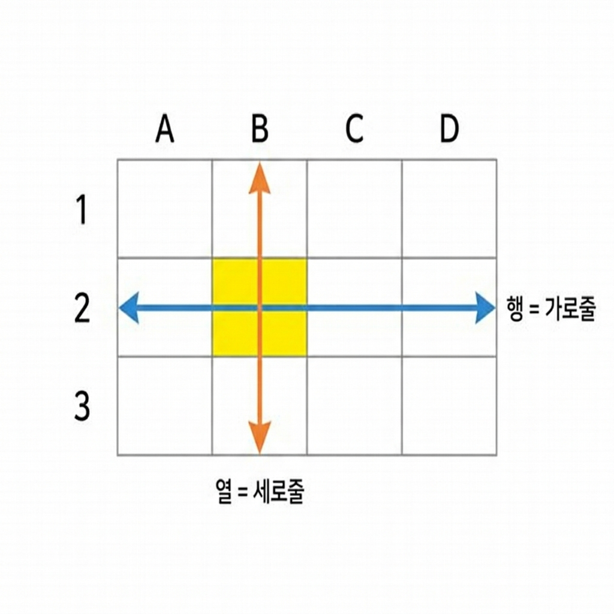
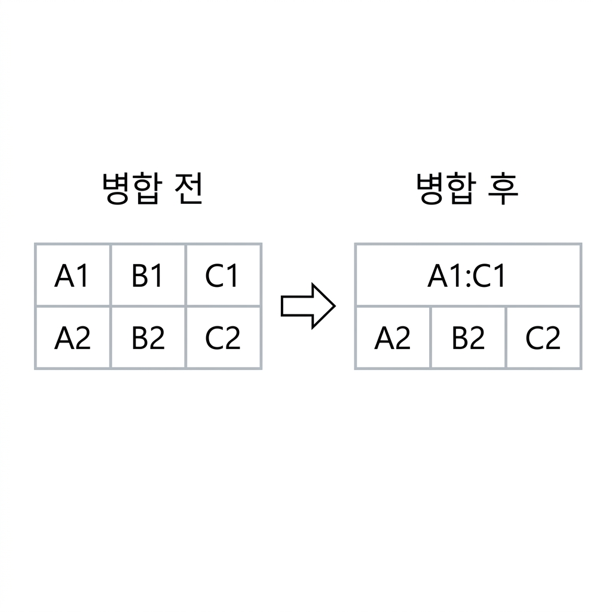
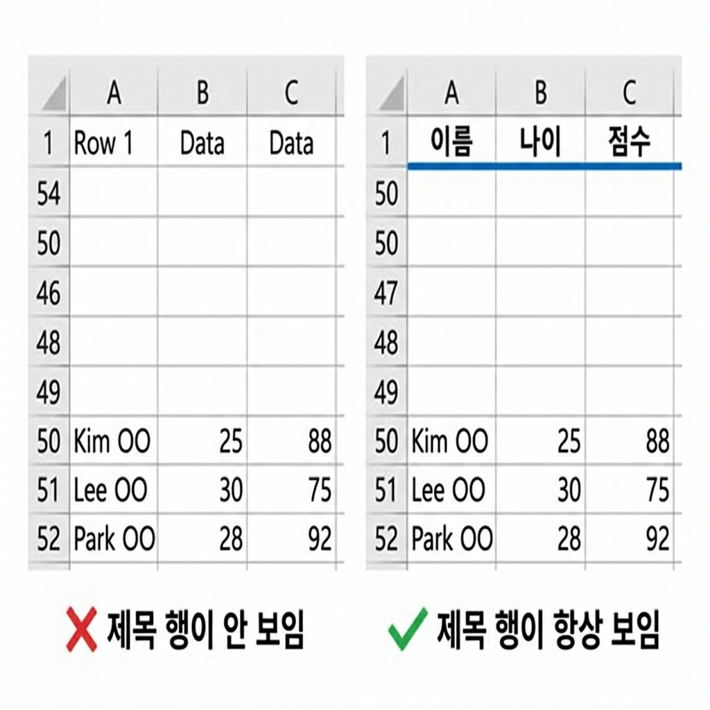

# 📌 3강: 행, 열, 셀 자유자재로 다루기

> **핵심 포인트**: 행과 열을 삽입·삭제·숨기며 표의 구조를 자유롭게 바꾸고, 셀 병합과 틀 고정을 활용합니다.

---

## 📖 이론 (20분)

### 행(Row)과 열(Column) 복습



- **행(Row)**: 가로 한 줄 (1, 2, 3, ...)
- **열(Column)**: 세로 한 줄 (A, B, C, ...)

### 행/열 선택하기

| 대상 | 방법 | 단축키 |
|------|------|--------|
| 행 전체 | 행 번호 클릭 | `Shift+Space` |
| 열 전체 | 열 머리글(A, B, ...) 클릭 | `Ctrl+Space` |
| 여러 행 | 행 번호를 드래그 | — |
| 여러 열 | 열 머리글을 드래그 | — |
| 떨어진 행/열 | `Ctrl` 누른 채 클릭 | — |
| 시트 전체 | 행/열 교차점(좌상단) 클릭 | `Ctrl+A` |

### 행/열 삽입과 삭제

#### 삽입하기
- **행 삽입**: 행 번호 우클릭 → "삽입" → 위에 새 행 추가
- **열 삽입**: 열 머리글 우클릭 → "삽입" → 왼쪽에 새 열 추가
- **단축키**: 행/열 선택 후 `Ctrl+Shift+=`

#### 삭제하기
- **행 삭제**: 행 번호 우클릭 → "삭제" → 해당 행 제거
- **열 삭제**: 열 머리글 우클릭 → "삭제" → 해당 열 제거
- **단축키**: 행/열 선택 후 `Ctrl+-`

> ⚠️ **주의**: `Delete` 키는 셀 **내용만** 삭제합니다. 행/열 자체를 삭제하려면 우클릭 → "삭제"를 사용하세요!

### 행/열 숨기기/표시

데이터를 지우지 않고 **일시적으로 감추고 싶을 때** 사용합니다.

- **숨기기**: 행/열 선택 → 우클릭 → "숨기기"
- **다시 표시**: 숨긴 행/열 양쪽을 선택 → 우클릭 → "숨기기 취소"

```
숨기기 전:          숨기기 후:
A  B  C  D         A  B  D    ← C열이 사라짐!
                    (B와 D 사이에 선이 두 줄)
```

### 너비와 높이 조절

| 대상 | 방법 |
|------|------|
| 열 너비 조절 | 열 머리글 경계선을 좌우 드래그 |
| 행 높이 조절 | 행 번호 경계선을 상하 드래그 |
| 자동 맞춤 | 열 머리글 경계선을 **더블클릭** (내용에 맞게 자동 조절!) |
| 정확한 값 지정 | 우클릭 → "열 너비" / "행 높이" → 숫자 입력 |

> 💡 **꿀팁**: 여러 열을 같은 너비로 맞추려면 → 열 여러 개를 선택 → 경계선 드래그 → 모두 동일하게!

### 셀 병합

여러 셀을 **하나로 합치는** 기능입니다. 제목이나 머리글에 자주 사용합니다.



**방법**: 셀 범위 선택 → 홈 탭 → "병합하고 가운데 맞춤" 클릭

> ⚠️ **주의**: 병합하면 왼쪽 위 셀의 데이터만 남고 나머지는 삭제됩니다!
> 정렬/필터에서 문제를 일으킬 수 있으므로, 데이터 영역에서는 가급적 사용하지 마세요.

### 틀 고정 (Freeze Panes) ⭐

데이터가 많아서 스크롤할 때, **제목 행이 사라지지 않도록** 고정하는 기능입니다.



**방법**: 보기 탭 → "틀 고정" → 원하는 옵션 선택

| 옵션 | 효과 |
|------|------|
| 첫 행 고정 | 1행(제목행)만 고정 |
| 첫 열 고정 | A열만 고정 |
| 틀 고정 | 현재 선택한 셀 기준으로 위쪽 행 + 왼쪽 열 모두 고정 |

> 💡 **가장 실용적**: `A2` 셀을 선택한 후 "틀 고정"을 누르면 1행 전체가 고정됩니다!

### ⌨️ 이번 강의 필수 단축키

| 단축키 | 기능 |
|--------|------|
| `Shift+Space` | 현재 행 전체 선택 |
| `Ctrl+Space` | 현재 열 전체 선택 |
| `Ctrl+Shift+=` | 행/열 삽입 |
| `Ctrl+-` | 행/열 삭제 |
| `Ctrl+A` | 시트 전체 선택 |
| `Ctrl+Home` | A1 셀로 이동 |

---

## 🔨 가이드 실습 (25분)

### 실습 1: 시간표 만들기 (10분)

**목표**: 행/열 조작으로 깔끔한 주간 시간표를 만듭니다.

1. **기본 틀 만들기**:
   - `B1`에 `월`, 자동 채우기로 `C1`~`F1`에 화~금
   - `A2`에 `1교시`, 자동 채우기로 `A3`~`A8`에 2교시~7교시

2. **과목 입력**:
   - 각 셀에 과목명 입력 (국어, 수학, 영어, 과학 등)

3. **열 너비 조절**:
   - B~F열을 모두 선택 → 경계선 드래그 → 동일한 너비로 맞추기

4. **제목 행 추가**:
   - 1행 위에 행 삽입 (`1행 선택 → Ctrl+Shift+=`)
   - A1:F1 셀 병합 → "📅 나의 주간 시간표" 입력

5. **틀 고정**:
   - `B3` 셀 선택 → 보기 → 틀 고정
   - 아래로 스크롤해도 요일과 교시가 보이는지 확인!


> ⚠️ **막힐 수 있는 포인트**:
> - **셀 병합 버튼을 못 찾겠어요** → 홈 탭 → "맞춤" 그룹에 있는 "병합하고 가운데 맞춤" 버튼입니다
> - **병합했는데 데이터가 사라졌어요** → 병합 시 왼쪽 위 셀의 데이터만 남습니다. 다른 셀의 데이터는 미리 옮기세요
> - **틀 고정을 했는데 원하는 대로 안 돼요** → 틀 고정은 **선택한 셀의 위쪽 행과 왼쪽 열**이 고정됩니다. B3을 선택하면 1~2행과 A열이 고정됩니다

### 실습 2: 표 구조 수정 연습 (8분)

**목표**: 이미 만들어진 표에서 행/열을 자유롭게 조작합니다.

아래 표를 먼저 만드세요:

| | A | B | C | D | E |
|--|
> ⚠️ **막힐 수 있는 포인트**:
> - **행을 삭제했는데 `Ctrl+Z`로 되돌릴 수 있나요?** → 네, 행/열 삭제는 되돌리기가 됩니다! (시트 삭제와 다릅니다)
> - **열 삽입을 했는데 원하는 위치가 아니에요** → 열 삽입은 선택한 열의 **왼쪽**에 삽입됩니다. D열을 우클릭하면 C와 D 사이에 새 열이 들어갑니다
> - **숨긴 열을 다시 표시하는 법을 모르겠어요** → 숨긴 열의 **양쪽 열 머리글**을 드래그하여 선택 → 우클릭 → "숨기기 취소"

---|---|---|---|---|
| 1 | 이름 | 나이 | 성별 | 혈액형 | 거주지 |
| 2 | 김OO | 25 | 남 | A | 서울 |
| 3 | 이OO | 30 | 여 | B | 부산 |
| 4 | 박OO | 28 | 남 | O | 대구 |
| 5 | 정OO | 22 | 여 | AB | 인천 |
| 6 | 최OO | 35 | 남 | A | 서울 |

아래 작업을 순서대로 해보세요:
1. C열(성별) 뒤에 "전화번호" 열 삽입 → D열 머리글 우클릭 → 삽입
2. 3행(이OO) 삭제 → 3행 번호 우클릭 → 삭제
3. "거주지" 열 숨기기 → 해당 열 우클릭 → 숨기기
4. 숨긴 열 다시 표시 → 양쪽 열 선택 → 우클릭 → 숨기기 취소

### 실습 3: 열 너비 자동 맞춤 (7분)

**목표**: 다양한 길이의 텍스트를 입력하고 열 너비를 자동으로 맞춥니다.

1. A1~A3에 길이가 서로 다른 텍스트를 입력하세요 (예: "가", "가나다라마바사아자차카타파하", "안녕하세요")
2. A열 머리글 경계선을 **더블클릭** → 가장 긴 텍스트에 맞춰 자동 조절!
3. B~C열에도 아무 텍스트 입력 후, B~C열을 선택 → 우클릭 → "열 너비" → `15` 입력
4. A열(자동 맞춤)과 B~C열(수동 지정)의 너비 차이를 비교해보세요


> ⚠️ **막힐 수 있는 포인트**:
> - **열 머리글 경계선 더블클릭이 안 돼요** → 열 머리글(A, B, C...) 사이의 **세로 경계선** 위에 정확히 마우스를 올려야 합니다. 마우스가 ↔ 모양으로 바뀔 때 더블클릭하세요
> - **"열 너비" 메뉴가 안 보여요** → 열 머리글을 우클릭해야 합니다. 셀을 우클릭하면 다른 메뉴가 나타납니다

---

## 🎯 자율 실습 (25분)

[TOPIC_POOL.md](TOPIC_POOL.md)에서 마음에 드는 주제를 골라 자유롭게 도전해보세요!

**이번 강의 추천 주제**: 🟢 주간 시간표 만들기, 🟡 영화 관람 기록표

---

## ✅ 이번 강의 체크리스트

- [ ] 행과 열을 선택할 수 있다 (행 번호 / 열 머리글 클릭)
- [ ] 행/열을 삽입하고 삭제할 수 있다
- [ ] 행/열을 숨기고 다시 표시할 수 있다
- [ ] 열 너비와 행 높이를 조절할 수 있다 (드래그, 더블클릭, 숫자 입력)
- [ ] 셀 병합을 할 수 있다 (그리고 주의사항을 안다)
- [ ] 틀 고정을 사용하여 제목 행을 고정할 수 있다

---

## 🔗 다음 강의

[4강: 통합 문서와 시트 관리](../L04_통합문서와_시트_관리/README.md) — 여러 시트를 활용하고 파일을 다양한 형식으로 저장하기
