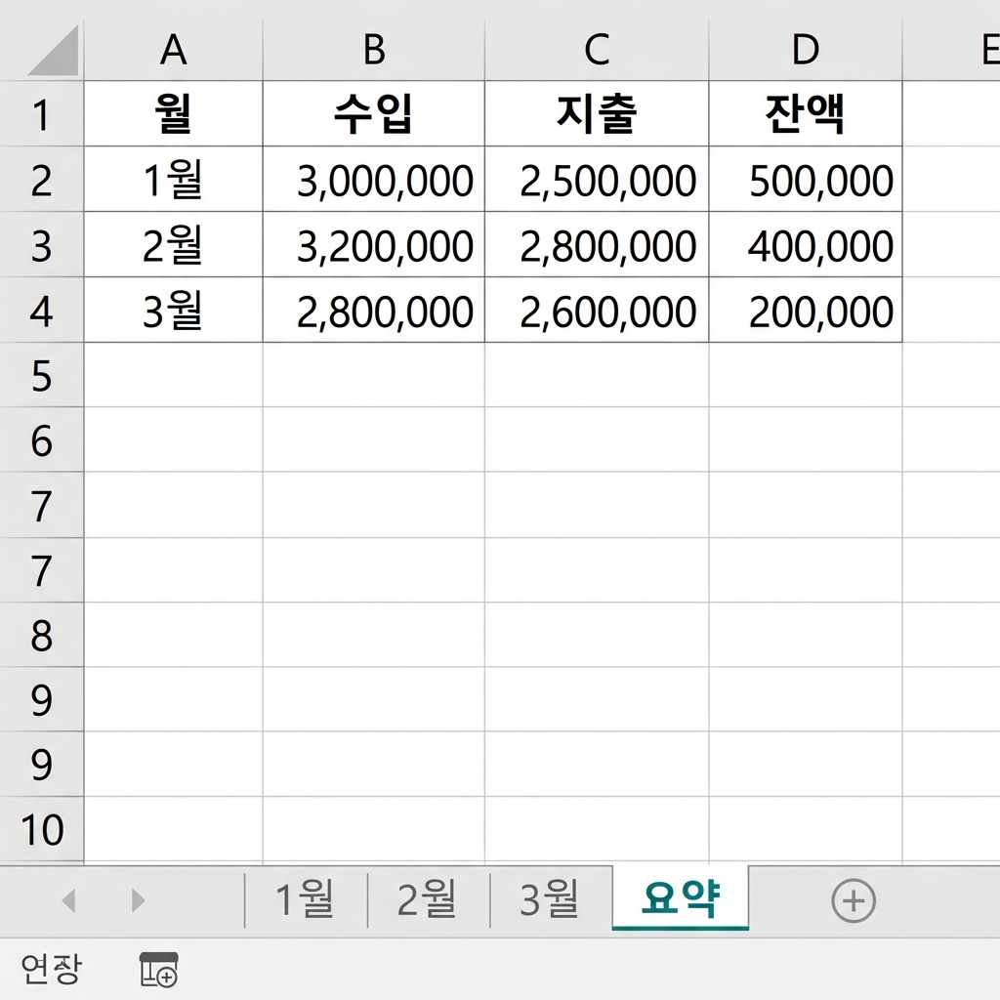

# 📌 4강: 통합 문서와 시트 관리

> **핵심 포인트**: 여러 시트를 효율적으로 관리하고, 파일을 다양한 형식(xlsx, csv, pdf)으로 저장합니다.

---

## 📖 이론 (20분)

### 통합 문서(Workbook)와 시트(Worksheet)

엑셀 파일 하나를 **통합 문서(Workbook)**라고 합니다. 하나의 통합 문서 안에 여러 개의 **시트(Sheet)**를 만들 수 있습니다.

```
📁 통합 문서 (= 엑셀 파일 1개)
├── 📄 Sheet1 (시트 1)
├── 📄 Sheet2 (시트 2)
└── 📄 Sheet3 (시트 3)

비유하면:
📓 바인더 노트 = 통합 문서
├── 📝 첫 번째 페이지 = Sheet1
├── 📝 두 번째 페이지 = Sheet2
└── 📝 세 번째 페이지 = Sheet3
```

### 시트 관리 기본

#### 시트 추가
- 시트 탭 옆의 **`+`** 버튼 클릭
- 또는 `Shift+F11`

#### 시트 이름 변경
- 시트 탭을 **더블클릭** → 이름 입력 → Enter
- 또는 시트 탭 우클릭 → "이름 바꾸기"

> 💡 시트 이름을 구체적으로 짓는 것이 좋습니다!
> ❌ Sheet1, Sheet2, Sheet3
> ✅ 매출현황, 직원목록, 경비내역

#### 시트 탭 색상 변경
- 시트 탭 우클릭 → "탭 색" → 원하는 색상 선택
- 시트가 많을 때 카테고리별로 색을 구분하면 편합니다

#### 시트 이동/복사
- **이동**: 시트 탭을 드래그하여 원하는 위치로
- **복사**: `Ctrl` 누른 채 시트 탭을 드래그 (탭에 (2)가 붙음)
- 또는 시트 탭 우클릭 → "이동/복사"

#### 시트 삭제
- 시트 탭 우클릭 → "삭제"

> ⚠️ **주의**: 시트 삭제는 **되돌리기(Ctrl+Z)가 안 됩니다!** 매우 신중하게!

### 시트 간 이동

| 방법 | 설명 |
|------|------|
| 시트 탭 클릭 | 가장 기본적인 방법 |
| `Ctrl+Page Down` | 다음(오른쪽) 시트로 이동 |
| `Ctrl+Page Up` | 이전(왼쪽) 시트로 이동 |
| 시트 탭 좌측 화살표 | 탭이 많을 때 탭 목록 스크롤 |

### 파일 저장 형식

엑셀 파일은 다양한 형식으로 저장할 수 있습니다:

| 형식 | 확장자 | 용도 | 특징 |
|------|--------|------|------|
| **Excel 통합 문서** | `.xlsx` | 일반 저장 | 가장 기본, 수식/서식 모두 보존 |
| **Excel 매크로 사용 통합 문서** | `.xlsm` | 매크로 포함 | VBA 코드가 있을 때 |
| **CSV** | `.csv` | 데이터 교환 | 서식 없이 데이터만, 시트 1개만 |
| **PDF** | `.pdf` | 배포/인쇄 | 수정 불가, 누구나 열 수 있음 |
| **Excel 97-2003 통합 문서** | `.xls` | 호환성 | 오래된 버전과 호환 |

### 저장하기 vs 다른 이름으로 저장

| 기능 | 단축키 | 설명 |
|------|--------|------|
| **저장** | `Ctrl+S` | 현재 파일에 덮어쓰기 (첫 저장 시 대화상자 표시) |
| **다른 이름으로 저장** | `F12` | 새 이름/위치/형식으로 저장 |

### CSV란?

**C**omma **S**eparated **V**alues — 쉼표로 구분된 값

```
일반 엑셀 파일 (.xlsx):        CSV 파일 (.csv):
┌──────┬──────┬──────┐        이름,나이,점수
│ 이름 │ 나이 │ 점수 │        홍길동,25,90
├──────┼──────┼──────┤   →    김철수,30,85
│홍길동│  25  │  90  │        이영희,28,92
│김철수│  30  │  85  │
│이영희│  28  │  92  │
└──────┴──────┴──────┘
```

> 💡 CSV는 다른 프로그램(구글 시트, 데이터베이스, 프로그래밍 언어)과 데이터를 주고받을 때 가장 많이 쓰는 형식입니다.

### ⌨️ 이번 강의 필수 단축키

| 단축키 | 기능 |
|--------|------|
| `Ctrl+Page Down` | 다음 시트로 |
| `Ctrl+Page Up` | 이전 시트로 |
| `Shift+F11` | 새 시트 삽입 |
| `F12` | 다른 이름으로 저장 |
| `Ctrl+S` | 저장 |
| `Ctrl+W` | 현재 통합 문서 닫기 |
| `Ctrl+N` | 새 통합 문서 |

---

## 🔨 가이드 실습 (25분)

### 실습 1: 가계부 시트 분리하기 (10분)

**목표**: 월별로 시트를 나누어 체계적인 가계부를 만듭니다.

**📋 완성 결과 미리보기**:



1. **시트 3개 만들기**:
   - Sheet1 → 더블클릭 → 이름을 `인적사항`으로 변경
   - `+` 버튼으로 Sheet2 추가 → 이름을 `학력사항`으로 변경
   - `+` 버튼으로 Sheet3 추가 → 이름을 `경력사항`으로 변경

2. **시트 탭 색상 설정**:
   - `인적사항` 탭 → 우클릭 → 탭 색 → 🔵 파랑
   - `학력사항` 탭 → 탭 색 → 🟢 초록
   - `경력사항` 탭 → 탭 색 → 🟡 노랑

3. **각 시트에 내용 입력**:
   
   `인적사항` 시트:
   ```
   A1: 이름     B1: (본인 이름)
   A2: 생년월일  B2: (날짜)
   A3: 연락처    B3: (전화번호)
   A4: 이메일    B4: (이메일)
   A5: 주소     B5: (주소)
   ```
   
   `학력사항` 시트:
   ```
   A1: 기간      B1: 학교명      C1: 전공      D1: 학위
   ```
   
   `경력사항` 시트:
   ```
   A1: 기간      B1: 회사명      C1: 부서      D1: 직위
   ```

4. **시트 이동 연습**: `Ctrl+Page Down`과 `Ctrl+Page Up`으로 시트 간 빠르게 이동

### 실습 2: 다양한 형식으로 저장하기 (10분)

**목표**: 같은 파일을 여러 형식으로 저장하고 차이를 확인합니다.

1. **xlsx로 저장**: `Ctrl+S` → 파일명: `나의이력서` → 저장
2. **PDF로 저장**: `F12` → 파일 형식을 `PDF`로 선택 → 저장 → PDF가 열리는지 확인
3. **CSV로 저장**: `F12` → 파일 형식을 `CSV (쉼표로 분리)`로 선택 → 저장
   - 경고 메시지가 나타납니다: "현재 시트만 저장됩니다" → 확인
   - CSV 파일을 메모장으로 열어보면? 쉼표로 구분된 텍스트!

### 실습 3: 시트 복사로 템플릿 활용하기 (5분)

**목표**: 한 시트를 복사하여 반복 작업을 줄입니다.

1. `학력사항` 시트 탭을 `Ctrl` 누른 채 오른쪽으로 드래그 → `학력사항 (2)` 생성
2. 복사된 시트 이름을 `자격증`으로 변경
3. 열 제목을 자격증에 맞게 수정 (취득일, 자격증명, 발급기관, 등급)

---

## 🎯 자율 실습 (25분)

[TOPIC_POOL.md](TOPIC_POOL.md)에서 마음에 드는 주제를 골라 자유롭게 도전해보세요!

**이번 강의 추천 주제**: 🟢 이력서/자기소개서 양식, 🟡 여행 계획 노트

---

## ✅ 이번 강의 체크리스트

- [ ] 시트를 추가, 이름 변경, 삭제할 수 있다
- [ ] 시트 탭 색상을 변경할 수 있다
- [ ] 시트를 이동하고 복사할 수 있다
- [ ] Ctrl+Page Down/Up으로 시트 간 빠르게 이동할 수 있다
- [ ] xlsx, csv, pdf의 차이를 이해했다
- [ ] F12로 다른 형식으로 저장할 수 있다

---

## 🔗 다음 강의

[5강: 셀 서식의 마법](../L05_셀_서식의_마법/README.md) — 밋밋한 표를 전문가처럼 꾸미기
