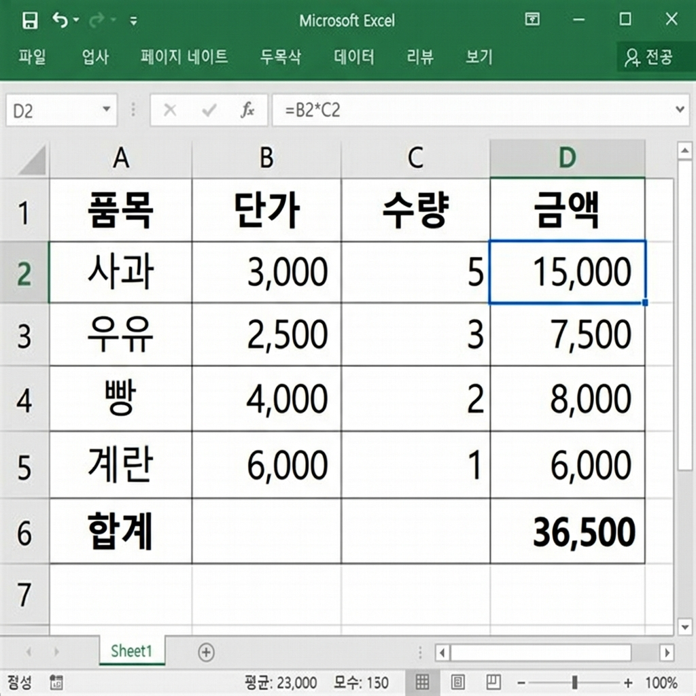

# 📌 8강: 첫 수식 만들기 — 사칙연산과 자동 계산

> **핵심 포인트**: `=` 기호로 수식을 시작하고, 셀 참조를 활용한 사칙연산과 자동 합계를 익힙니다.

---

## 📖 이론 (20분)

### 엑셀의 진짜 힘 = 수식(Formula)

지금까지는 엑셀을 "입력 + 꾸미기" 도구로만 사용했습니다. 이제부터 엑셀의 **진짜 위력**인 자동 계산을 배웁니다!

> 🔑 **핵심 규칙**: 모든 수식은 반드시 **`=`** (등호)로 시작합니다!

### 직접 값 계산 vs 셀 참조 계산

```
방법 1: 직접 값 계산 (❌ 비추천)
┌──────────┐
│ =100+200 │ → 결과: 300
└──────────┘
값이 바뀌면 수식도 다시 써야 함!

방법 2: 셀 참조 계산 (✅ 추천!)
┌───┬───┬──────────┐
│A1 │B1 │    C1    │
│100│200│ =A1+B1   │ → 결과: 300
└───┴───┴──────────┘
A1이나 B1 값을 바꾸면 C1이 자동 업데이트!
```

> 🎵 **이것이 엑셀의 핵심!** 셀 참조를 사용하면 원본 데이터를 바꿀 때 모든 계산이 자동으로 갱신됩니다.

### 사칙연산 기호

| 연산 | 엑셀 기호 | 예시 | 결과 |
|------|----------|------|------|
| 더하기 | `+` | `=A1+B1` | 두 셀의 합 |
| 빼기 | `-` | `=A1-B1` | 두 셀의 차 |
| 곱하기 | `*` | `=A1*B1` | 두 셀의 곱 |
| 나누기 | `/` | `=A1/B1` | 두 셀의 몫 |
| 거듭제곱 | `^` | `=A1^2` | A1의 제곱 |
| 나머지 | — | `=MOD(A1,B1)` | 나머지 (함수) |

### 연산 우선순위

수학과 동일합니다:

```
우선순위: 괄호() → 거듭제곱(^) → 곱하기·나누기(*,/) → 더하기·빼기(+,-)

예시:
=2+3*4     → 14  (곱하기 먼저!)
=(2+3)*4   → 20  (괄호 먼저!)
=10/2+3    → 8   (나누기 먼저!)
=10/(2+3)  → 2   (괄호 먼저!)
```

> 💡 **팁**: 우선순위가 헷갈리면 **괄호로 감싸세요!** 절대 틀리지 않습니다.

### 수식 입력 방법

#### 방법 1: 직접 타이핑
1. 결과를 표시할 셀 클릭
2. `=` 입력
3. 셀 주소 직접 타이핑 (예: `=A1+B1`)
4. `Enter`

#### 방법 2: 마우스 클릭 (추천! ⭐)
1. 결과를 표시할 셀 클릭
2. `=` 입력
3. 첫 번째 셀을 **마우스로 클릭** (자동으로 주소 입력됨)
4. 연산자(`+`, `-`, `*`, `/`) 입력
5. 두 번째 셀을 **마우스로 클릭**
6. `Enter`

> 💡 셀을 직접 클릭하면 **타이핑 실수를 줄일 수 있어서** 초보자에게 특히 추천합니다!

### 자동 합계 (AutoSum) ⭐

숫자들의 합계를 한 번에 구하는 가장 쉬운 방법입니다.

```
    A
1  100
2  200
3  300
4  ← 여기에 커서 놓고 Alt+= 누르기!
    ↓
4  =SUM(A1:A3)  → 600
```

**사용법**:
1. 합계를 넣을 셀 선택 (숫자 아래 또는 오른쪽)
2. `Alt+=` 누르기 (또는 홈 → Σ 자동 합계)
3. 범위가 자동으로 지정됨 (파란 테두리)
4. 맞으면 `Enter`, 수정이 필요하면 범위 다시 드래그

### 수식 복사 (자동 채우기로!)

한 셀에 수식을 만들면, **채우기 핸들**로 다른 셀에 복사할 수 있습니다!

```
     A       B       C(=A*B)
1   품명    단가     수량     금액
2   연필    500      10      =B2*C2  ← 첫 수식 입력
3   지우개   300      5      ← 채우기 핸들로 내리면 =B3*C3 자동!
4   노트    1500     3      ← =B4*C4 자동!
```

> 🎵 이것이 **상대 참조**의 마법입니다! (10강에서 자세히 배웁니다)

### ⌨️ 이번 강의 필수 단축키

| 단축키 | 기능 |
|--------|------|
| `=` | 수식 시작 |
| `Enter` | 수식 확정 + 아래로 이동 |
| `Tab` | 수식 확정 + 오른쪽으로 이동 |
| `Esc` | 수식 입력 취소 |
| `Alt+=` | 자동 합계 (SUM) |
| `F2` | 셀 편집 모드 (수식 수정) |
| `Ctrl+~` | 수식 표시/값 표시 토글 |

---

## 🔨 가이드 실습 (25분)

**📋 완성 결과 미리보기**:



### 실습 1: 장보기 계산기 (12분)

**목표**: 셀 참조와 사칙연산으로 장보기 목록의 총액을 자동 계산합니다.

1. **표 만들기**:
   ```
        A        B        C         D
   1행  품목     단가     수량      금액
   2행  사과     3000     5         (수식)
   3행  우유     2500     2         (수식)
   4행  빵       4000     1         (수식)
   5행  계란     6000     2         (수식)
   6행  라면     3500     3         (수식)
   7행                              합계: (수식)
   ```

2. **금액 수식 입력 (D2)**:
   - D2 셀 클릭 → `=` 입력 → B2 클릭 → `*` 입력 → C2 클릭 → `Enter`
   - 결과: `=B2*C2` → 15000

3. **수식 복사**:
   - D2의 채우기 핸들을 D6까지 드래그
   - D3~D6에 자동으로 수식이 복사됨!

4. **합계 구하기**:
   - D7 셀 클릭 → `Alt+=` (자동 합계)
   - 자동으로 `=SUM(D2:D6)` 생성 → `Enter`

5. **테스트**: B2(사과 단가)를 `3500`으로 변경 → D2와 D7이 자동 업데이트!

### 실습 2: 연산 우선순위 체험 (8분)

**목표**: 괄호 유무에 따라 결과가 달라지는 것을 확인합니다.

```
     A열(수식)              B열(결과)    C열(설명)
1행  =2+3*4                (결과?)      곱하기 먼저
2행  =(2+3)*4              (결과?)      괄호 먼저
3행  =10-6/2               (결과?)      나누기 먼저
4행  =(10-6)/2             (결과?)      괄호 먼저
5행  =2^3+1                (결과?)      거듭제곱 먼저
6행  =2^(3+1)              (결과?)      괄호 먼저
```

- A열에 수식 입력, C열에 예상 답을 먼저 적어보고, 실제 결과와 비교!
- 틀린 것이 있다면 왜 틀렸는지 생각해보세요.

### 실습 3: Ctrl+~ 로 수식 구경하기 (7분)

**목표**: 수식 표시 모드를 활용하여 전체 구조를 파악합니다.

1. 실습 1에서 만든 장보기 계산기 열기
2. `Ctrl+~` 키를 누르기 (백틱/물결 키)
3. 모든 셀의 **수식이 표시**됩니다! 값 대신 `=B2*C2` 같은 수식이 보여요
4. 다시 `Ctrl+~` → 원래 값 표시로 돌아감

> 💡 이 기능은 "이 셀에 어떤 수식이 들어있지?"를 한눈에 확인할 때 매우 유용합니다!

---

## 🎯 자율 실습 (25분)

[TOPIC_POOL.md](TOPIC_POOL.md)에서 마음에 드는 주제를 골라 자유롭게 도전해보세요!

**이번 강의 추천 주제**: 🟢 장보기 자동 합계, 🟡 더치페이 계산기

---

## ✅ 이번 강의 체크리스트

- [ ] 수식은 반드시 `=`로 시작한다는 것을 안다
- [ ] 셀 참조를 사용하여 수식을 만들 수 있다 (=A1+B1 등)
- [ ] 사칙연산 기호(+, -, *, /)를 사용할 수 있다
- [ ] 연산 우선순위를 이해하고 괄호를 활용할 수 있다
- [ ] Alt+=로 자동 합계를 쓸 수 있다
- [ ] 수식을 채우기 핸들로 다른 셀에 복사할 수 있다
- [ ] Ctrl+~로 수식 표시 모드를 켜고 끌 수 있다

---

## 🔗 다음 강의

[9강: 기본 함수 마스터](../L09_기본_함수_마스터/README.md) — SUM, AVERAGE, COUNT로 데이터 요약하기
