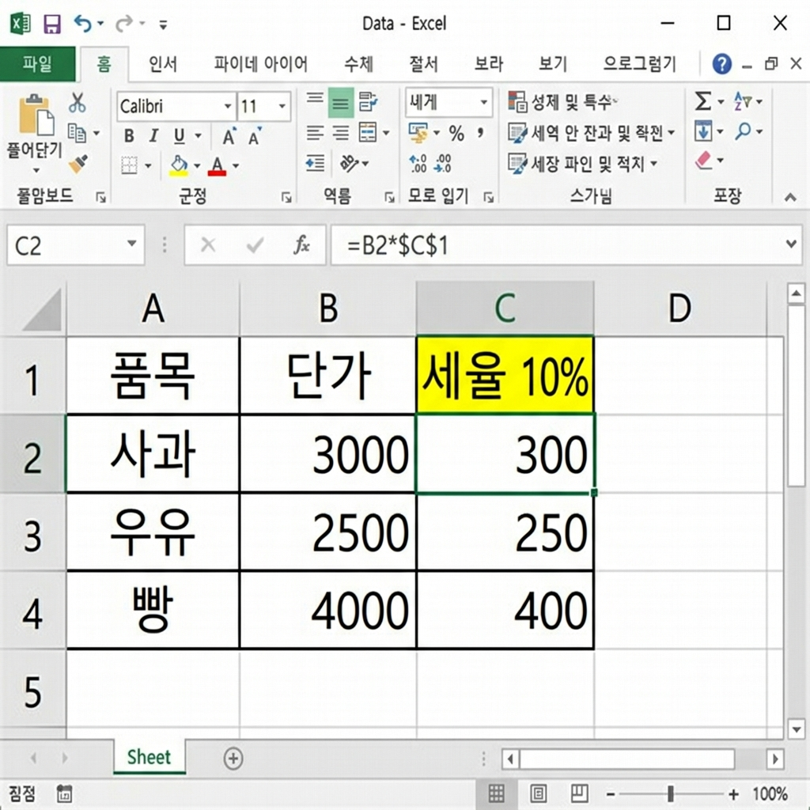

# 📌 10강: 셀 참조 완전정복 — $의 비밀

> **핵심 포인트**: 상대 참조, 절대 참조($), 혼합 참조의 차이를 이해하고, F4 키를 활용하여 수식을 정확하게 복사합니다.

---

## 📖 이론 (20분)

### 왜 셀 참조가 중요한가?

8~9강에서 수식을 채우기 핸들로 복사할 때, 셀 주소가 **자동으로 바뀌는** 것을 경험했습니다.
이것은 편리하지만, 때로는 **특정 셀은 고정**하고 싶을 때가 있습니다.

### 3가지 참조 방식

#### 1. 상대 참조 (Relative Reference) — 기본값

수식을 복사하면 **위치에 따라 셀 주소가 자동 변경**됩니다.

```
원래 수식 (D2):     아래로 복사하면:
=B2*C2              D3: =B3*C3  (행 번호 +1)
                    D4: =B4*C4  (행 번호 +1)
```

> 대부분의 경우 상대 참조가 적합합니다. **"같은 패턴의 계산을 여러 행에 적용"** 할 때!

#### 2. 절대 참조 (Absolute Reference) — `$` 사용

수식을 복사해도 **셀 주소가 절대 변하지 않습니다.**

```
=B2*$E$1     ← E1 셀은 $로 고정!

복사해도:
D2: =B2*$E$1
D3: =B3*$E$1  ← B는 변했지만 E1은 고정!
D4: =B4*$E$1  ← B는 변했지만 E1은 고정!
```

**사용하는 경우**: 세율, 환율, 할인율처럼 **모든 행에서 같은 셀을 참조**해야 할 때

```
실전 예시: 환율 계산

     A(달러)    B(원화)        E1에 환율: 1350
1행  $100      =A1*$E$1       → 135,000
2행  $200      =A2*$E$1       → 270,000
3행  $50       =A3*$E$1       → 67,500
                    ↑
              E1은 모든 행에서 고정!
```

#### 3. 혼합 참조 — `$`를 하나만

열 또는 행 **하나만 고정**합니다.

| 표기 | 의미 | 복사 시 변하는 것 |
|------|------|-----------------|
| `A1` | 상대 참조 | 행과 열 모두 변함 |
| `$A$1` | 절대 참조 | 아무것도 안 변함 |
| `$A1` | 혼합 (열 고정) | 행만 변함, A열 고정 |
| `A$1` | 혼합 (행 고정) | 열만 변함, 1행 고정 |

### F4 키 — 참조 전환의 마법 ⭐

수식 입력 중 셀 주소에 커서를 놓고 **F4 키를 누를 때마다** 참조 방식이 순환됩니다:

```
F4 한 번: A1   → $A$1  (절대 참조)
F4 두 번: $A$1 → A$1   (행 고정)
F4 세 번: A$1  → $A1   (열 고정)
F4 네 번: $A1  → A1    (상대 참조 - 원래대로)
```

> 🔑 **이것만 기억하세요**: `$`가 붙은 것은 고정! `$A`면 A열 고정, `$1`이면 1행 고정!

### 다른 시트 참조

같은 통합 문서의 다른 시트에 있는 셀을 참조할 수 있습니다:

```
=시트이름!셀주소

예시:
=Sheet2!A1          → Sheet2의 A1 셀 값
=매출현황!B5         → "매출현황" 시트의 B5 셀 값
=SUM(1월!A1:A10)    → "1월" 시트의 A1:A10 합계
```

### ⌨️ 이번 강의 필수 단축키

| 단축키 | 기능 |
|--------|------|
| `F4` | 참조 전환 ($A$1 ↔ A$1 ↔ $A1 ↔ A1) |
| `Ctrl+~` | 수식 표시 / 값 표시 토글 |
| `F2` | 수식 편집 모드 |

---

## 🔨 가이드 실습 (25분)

**📋 완성 결과 미리보기**:



### 실습 1: 절대 참조 — 부가세 계산기 (10분)

**목표**: 세율을 한 셀에 고정하고, 모든 상품에 적용합니다.

1. **데이터 준비**:
   ```
        A        B          C           D
   1행  부가세율: 10%        (E1에 0.1 입력, % 표시 형식)
   2행
   3행  품목     공급가액    부가세      합계
   4행  모니터   500,000    (수식)      (수식)
   5행  키보드   80,000     (수식)      (수식)
   6행  마우스   35,000     (수식)      (수식)
   7행  헤드셋   120,000    (수식)      (수식)
   ```

2. **부가세 수식 (C4)**:
   - C4 클릭 → `=B4*` 입력 → E1 클릭 → **F4 키** (→ `$E$1`로 변환) → Enter
   - 결과: `=B4*$E$1` → 50,000

3. **수식 복사**:
   - C4의 채우기 핸들을 C7까지 드래그
   - `Ctrl+~`로 확인: C5는 `=B5*$E$1`, C6은 `=B6*$E$1` → E1이 고정!

4. **합계 수식 (D4)**:
   - `=B4+C4` → 채우기 핸들로 D7까지 복사

5. **테스트**: E1(세율)을 `0.05` (5%)로 변경 → 모든 부가세가 자동 갱신!

### 실습 2: 상대 참조 vs 절대 참조 비교 (8분)

**목표**: 같은 수식을 상대/절대 참조로 만들어 차이를 직접 확인합니다.

1. **데이터**:
   ```
        A     B
   1행  10    3    ← 곱할 수(B1)
   2행  20
   3행  30
   4행  40
   5행  50
   ```

2. **C열: 상대 참조** (❌ 잘못된 예):
   - C1: `=A1*B1` → 채우기 핸들로 C5까지
   - C2는 `=A2*B2` → B2는 **빈 셀**이므로 결과 0! 💥

3. **D열: 절대 참조** (✅ 올바른 예):
   - D1: `=A1*$B$1` → 채우기 핸들로 D5까지
   - D2는 `=A2*$B$1` → B1이 고정되어 정상 작동! ✅

4. `Ctrl+~`로 두 열의 수식을 비교해보세요.

### 실습 3: 개인 가계부 — 누적 잔액 (7분)

**목표**: 절대 참조를 활용한 실전 가계부를 만듭니다.

```
     A         B       C        D          E
1행  초기잔액:  1,000,000               (B1에 금액 입력)
2행
3행  날짜      내역    수입     지출       잔액
4행  3/1       월급    3000000            =B1+C4-D4
5행  3/3       식비             25000     =E4+C5-D5
6행  3/5       교통비           15000     =E5+C6-D6
7행  3/10      용돈    100000             =E6+C7-D7
```

- E4는 초기잔액 + 수입 - 지출: `=$B$1+C4-D4`
- E5부터는 이전 잔액 + 수입 - 지출: `=E4+C5-D5` (상대 참조로 충분!)
- 빈 셀(수입이나 지출이 없는 날)은 0으로 처리됩니다

---

## 🎯 자율 실습 (25분)

[TOPIC_POOL.md](TOPIC_POOL.md)에서 마음에 드는 주제를 골라 자유롭게 도전해보세요!

**이번 강의 추천 주제**: 🟢 개인 가계부 (절대 참조), 🟡 구구단 표 (혼합 참조)

---

## ✅ 이번 강의 체크리스트

- [ ] 상대 참조(A1)는 수식 복사 시 위치에 따라 변한다는 것을 안다
- [ ] 절대 참조($A$1)는 수식 복사해도 고정된다는 것을 안다
- [ ] $ 기호의 의미를 안다 ($A = A열 고정, $1 = 1행 고정)
- [ ] F4 키를 사용하여 참조 방식을 전환할 수 있다
- [ ] 세율/환율 같은 "모든 행에 공통으로 적용"할 값에 절대 참조를 쓸 수 있다
- [ ] 다른 시트의 셀을 참조하는 방법(=시트명!셀주소)을 안다

---

## 🔗 다음 강의

[11강: IF 함수와 논리 판단](../L11_IF_함수와_논리/README.md) — 조건에 따라 다른 결과를 내는 마법의 함수
