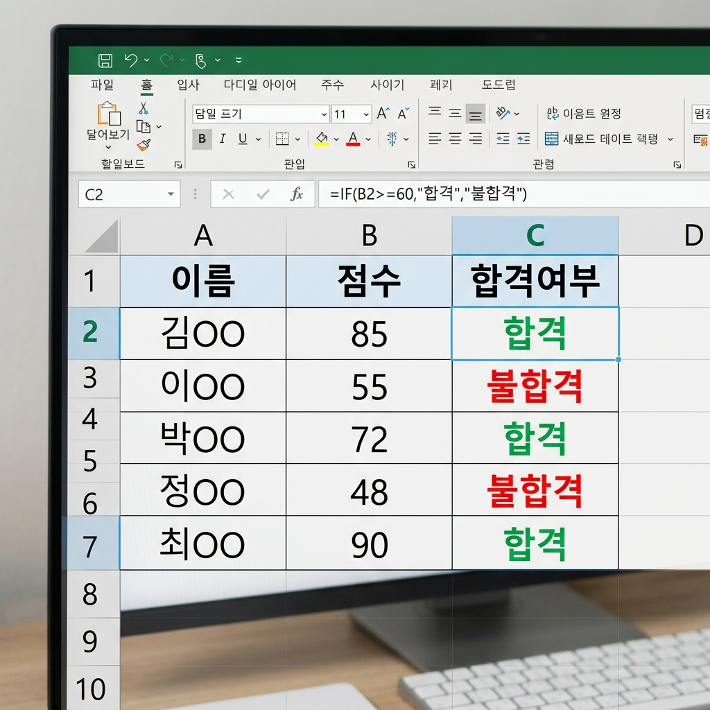

# 📌 11강: IF 함수와 논리 판단

> **핵심 포인트**: IF 함수로 조건에 따라 다른 결과를 나타내고, AND/OR로 복합 조건을 만들며, 중첩 IF와 IFS로 다중 조건을 처리합니다.

---

## 📖 이론 (20분)

### IF 함수란?

**"만약 ~이면 A, 아니면 B"** — 조건에 따라 **서로 다른 결과**를 반환하는 함수입니다.

```
=IF(조건, 참일 때 값, 거짓일 때 값)

예시:
=IF(A1>=60, "합격", "불합격")
   │         │        │
   │         │        └── 거짓일 때: "불합격"
   │         └────────── 참일 때: "합격"
   └──────────────────── 조건: A1이 60 이상인가?
```

### 비교 연산자

| 연산자 | 의미 | 예시 |
|--------|------|------|
| `=` | 같다 | `A1=100` |
| `<>` | 같지 않다 | `A1<>0` |
| `>` | 크다 | `A1>90` |
| `<` | 작다 | `A1<60` |
| `>=` | 크거나 같다 | `A1>=80` |
| `<=` | 작거나 같다 | `A1<=100` |

### IF 함수 실전 예시

| 상황 | 수식 |
|------|------|
| 합격/불합격 | `=IF(B2>=60, "합격", "불합격")` |
| 양수/음수 판별 | `=IF(B2>0, "이익", "손실")` |
| 출석 체크 | `=IF(B2="O", "출석", "결석")` |
| 할인 적용 | `=IF(B2>=100000, B2*0.9, B2)` (10만원 이상이면 10% 할인) |

### AND, OR, NOT — 복합 조건

#### AND: 모든 조건이 참이어야 참

```
=AND(조건1, 조건2, ...)

=IF(AND(B2>=80, C2>=80), "합격", "불합격")
→ B2도 80 이상 "그리고" C2도 80 이상일 때만 "합격"
```

#### OR: 하나라도 참이면 참

```
=OR(조건1, 조건2, ...)

=IF(OR(B2>=90, C2>=90), "우수", "보통")
→ B2 또는 C2 중 하나라도 90 이상이면 "우수"
```

#### NOT: 조건을 뒤집기

```
=NOT(조건)

=IF(NOT(A2=""), "입력됨", "비어있음")
→ A2가 비어있지 않으면 "입력됨"
```

### 중첩 IF — 여러 등급 판별 ⭐

IF 안에 IF를 넣어서 **3가지 이상의 결과**를 만듭니다:

```
=IF(B2>=90, "수",
  IF(B2>=80, "우",
    IF(B2>=70, "미",
      IF(B2>=60, "양", "가"))))

점수 → 등급:
90 이상 → 수
80~89  → 우
70~79  → 미
60~69  → 양
60 미만 → 가
```

> ⚠️ **주의**: 중첩 IF는 3~4단계까지가 한계입니다. 더 많아지면 IFS를 사용하세요!

### IFS — 중첩 IF의 깔끔한 대안

```
=IFS(조건1, 값1, 조건2, 값2, 조건3, 값3, ...)

=IFS(B2>=90, "수",
     B2>=80, "우",
     B2>=70, "미",
     B2>=60, "양",
     TRUE, "가")     ← TRUE = "그 외 모든 경우"
```

> 💡 IFS 함수는 Excel 2019 / Microsoft 365부터 사용 가능합니다.

### IFERROR — 오류 처리

수식 결과가 오류(#DIV/0!, #N/A 등)일 때 **대체 값을 표시**합니다.

```
=IFERROR(수식, 오류일 때 값)

=IFERROR(A1/B1, "계산 불가")
→ B1이 0이면 #DIV/0! 대신 "계산 불가" 표시
```

### ⌨️ 이번 강의 필수 단축키

| 단축키 | 기능 |
|--------|------|
| `Shift+F3` | 함수 마법사 (IF 함수 찾기) |
| `Alt+Enter` | 셀 내 줄 바꿈 (긴 수식 정리할 때) |

---

## 🔨 가이드 실습 (25분)

**📋 완성 결과 미리보기**:



### 실습 1: 시험 등급 자동 판정기 (12분)

**목표**: 점수를 입력하면 자동으로 등급(수/우/미/양/가)을 매기는 시스템을 만듭니다.

1. **데이터 입력**:
   ```
        A       B      C
   1행  이름    점수   등급
   2행  홍길동   95    (수식)
   3행  김영희   82    (수식)
   4행  이민수   74    (수식)
   5행  박지은   68    (수식)
   6행  정다빈   55    (수식)
   7행  강하늘   43    (수식)
   8행  최유진   90    (수식)
   ```

2. **등급 수식 (C2)** — 중첩 IF 사용:
   ```
   =IF(B2>=90,"수",IF(B2>=80,"우",IF(B2>=70,"미",IF(B2>=60,"양","가"))))
   ```

3. **수식 복사**: C2의 채우기 핸들을 C8까지 드래그

4. **합격/불합격 열 추가 (D열)**:
   - D2: `=IF(B2>=60,"합격","불합격")`
   - 채우기 핸들로 복사

5. **조건부 서식 결합**: "불합격" 셀에 빨간 배경 적용 (6강 복습!)

### 실습 2: AND/OR 활용 — 장학금 판정 (8분)

**목표**: 복합 조건으로 장학금 수혜 여부를 판별합니다.

기준: 국어 **그리고** 수학 모두 90점 이상이면 "장학금 대상"

```
     A       B     C      D
1행  이름    국어   수학   장학금
2행  홍길동   95    92    =IF(AND(B2>=90,C2>=90),"장학금","해당없음")
3행  김영희   88    95    =IF(AND(B3>=90,C3>=90),"장학금","해당없음")
4행  이민수   92    85    (수식 복사)
```

OR 버전도 만들어보세요:
- E열: 국어 **또는** 수학 중 하나라도 95점 이상이면 "특별 장학금"

### 실습 3: IFERROR 활용 (5분)

**목표**: 나눗셈 오류를 우아하게 처리합니다.

```
     A       B(수량)   C(단가)   D(합계)    E(1개당 가격)
1행  상품    수량      단가      합계       개당
2행  사과    10       3000     =B2*C2     =IFERROR(D2/B2, "-")
3행  배      0        5000     =B3*C3     =IFERROR(D3/B3, "-")  ← 0으로 나눠도 OK!
```

---

## 🎯 자율 실습 (25분)

[TOPIC_POOL.md](TOPIC_POOL.md)에서 마음에 드는 주제를 골라 자유롭게 도전해보세요!

**이번 강의 추천 주제**: 🟢 시험 성적 등급 자동 판정기, 🟡 택배비 자동 계산기

---

## ✅ 이번 강의 체크리스트

- [ ] IF 함수의 구조(조건, 참, 거짓)를 이해했다
- [ ] 비교 연산자(=, <>, >, <, >=, <=)를 사용할 수 있다
- [ ] AND(그리고)와 OR(또는)로 복합 조건을 만들 수 있다
- [ ] 중첩 IF로 3가지 이상의 결과를 만들 수 있다
- [ ] IFS 함수의 존재를 알고 있다
- [ ] IFERROR로 오류를 처리할 수 있다

---

## 🔗 다음 강의

[12강: 조건부 합계와 개수 (SUMIF, COUNTIF)](../L12_SUMIF_COUNTIF/README.md) — 특정 조건에 맞는 데이터만 골라서 합산하기
