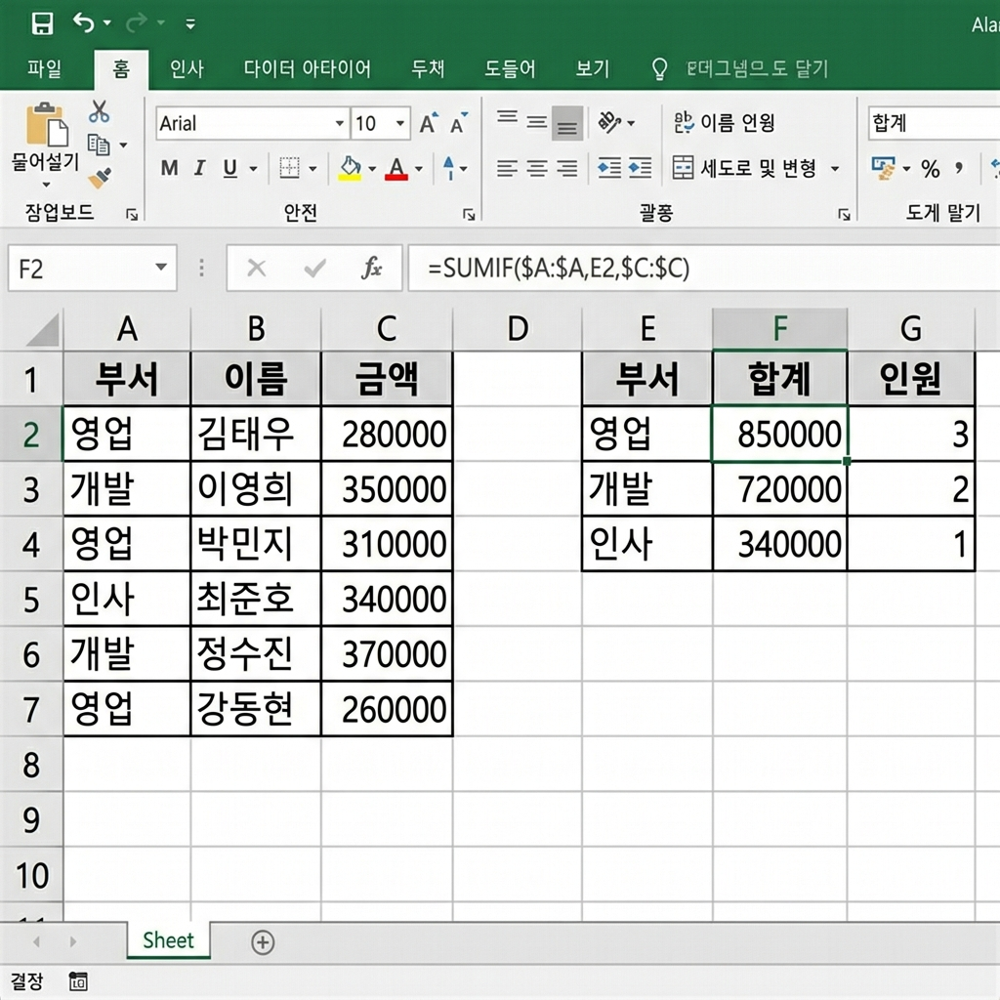

# 📌 12강: 조건부 합계와 개수 — SUMIF, COUNTIF 계열

> **핵심 포인트**: 특정 조건을 만족하는 데이터만 골라서 합산(SUMIF/SUMIFS)하거나 개수(COUNTIF/COUNTIFS)를 세는 함수를 마스터합니다.

---

## 📖 이론 (20분)

### SUMIF vs SUM + IF의 차이

```
SUM: 전체 합계              SUMIF: 조건에 맞는 것만 합계
=SUM(C2:C10)                =SUMIF(B2:B10, "식비", C2:C10)
→ 모든 금액 합계             → "식비"인 행의 금액만 합계!
```

### SUMIF — 조건부 합계

```
=SUMIF(조건범위, 조건, 합계범위)
        │        │      │
        │        │      └── 실제로 합산할 숫자들
        │        └────────── 어떤 조건? (예: "식비")
        └─────────────────── 조건을 확인할 열
```

#### 예시: 카테고리별 지출 합계

```
     A(날짜)    B(카테고리)    C(금액)
1행  3/1       식비          15,000
2행  3/2       교통          3,000
3행  3/3       식비          12,000
4행  3/4       문화          25,000
5행  3/5       교통          3,000
6행  3/6       식비          18,000

식비 합계:   =SUMIF(B1:B6, "식비", C1:C6)   → 45,000
교통 합계:   =SUMIF(B1:B6, "교통", C1:C6)   → 6,000
```

#### SUMIF 조건 활용법

| 조건 | 의미 | 예시 |
|------|------|------|
| `"식비"` | 정확히 일치 | `=SUMIF(B:B, "식비", C:C)` |
| `">"&10000` | 10000 초과 | `=SUMIF(C:C, ">"&10000, C:C)` |
| `">="&D1` | D1 셀 값 이상 | `=SUMIF(C:C, ">="&D1, C:C)` |
| `"*음식*"` | "음식" 포함 | `=SUMIF(B:B, "*음식*", C:C)` |

### SUMIFS — 다중 조건 합계

```
=SUMIFS(합계범위, 조건범위1, 조건1, 조건범위2, 조건2, ...)

예시: "식비"이면서 10,000원 이상인 금액의 합계
=SUMIFS(C1:C6, B1:B6, "식비", C1:C6, ">=10000")
```

> ⚠️ **주의**: SUMIF와 SUMIFS의 **인수 순서가 다릅니다!**
> - SUMIF: 조건범위, 조건, **합계범위**
> - SUMIFS: **합계범위**, 조건범위1, 조건1, ...

### COUNTIF — 조건부 개수

```
=COUNTIF(범위, 조건)

예시:
=COUNTIF(B1:B6, "식비")    → 3 (식비가 3번 나옴)
=COUNTIF(C1:C6, ">10000")  → 3 (10,000 초과가 3개)
```

### COUNTIFS — 다중 조건 개수

```
=COUNTIFS(범위1, 조건1, 범위2, 조건2, ...)

예시: "식비"이면서 15,000원 이상인 건수
=COUNTIFS(B1:B6, "식비", C1:C6, ">=15000")  → 2
```

### AVERAGEIF / AVERAGEIFS — 조건부 평균

```
=AVERAGEIF(조건범위, 조건, 평균범위)

예시: 식비의 평균 금액
=AVERAGEIF(B1:B6, "식비", C1:C6)  → 15,000
```

### 전체 함수 비교 요약

| 함수 | 기능 | 조건 개수 |
|------|------|----------|
| `SUMIF` | 조건부 합계 | 1개 |
| `SUMIFS` | 다중 조건 합계 | 여러 개 |
| `COUNTIF` | 조건부 개수 | 1개 |
| `COUNTIFS` | 다중 조건 개수 | 여러 개 |
| `AVERAGEIF` | 조건부 평균 | 1개 |
| `AVERAGEIFS` | 다중 조건 평균 | 여러 개 |

### ⌨️ 이번 강의 핵심 패턴

```
조건이 1개:   SUMIF  / COUNTIF  / AVERAGEIF
조건이 여러개: SUMIFS / COUNTIFS / AVERAGEIFS
```

---

## 🔨 가이드 실습 (25분)

**📋 완성 결과 미리보기**:



### 실습 1: 동아리 회비 관리 대장 (12분)

**목표**: 카테고리별 합계와 개수를 자동으로 집계합니다.

1. **회비 내역 입력**:
   ```
        A       B        C       D
   1행  날짜    이름     구분    금액
   2행  3/1     홍길동   납부    30,000
   3행  3/1     김영희   납부    30,000
   4행  3/5     이민수   납부    30,000
   5행  3/5     홍길동   지출    -15,000
   6행  3/8     박지은   납부    30,000
   7행  3/10    홍길동   지출    -25,000
   8행  3/12    정다빈   납부    30,000
   9행  3/15    이민수   지출    -10,000
   10행 3/20    강하늘   납부    30,000
   ```

2. **집계 영역 만들기** (F~G열):
   ```
   F2: 납부 합계    G2: =SUMIF(C2:C10, "납부", D2:D10)
   F3: 지출 합계    G3: =SUMIF(C2:C10, "지출", D2:D10)
   F4: 납부 인원    G4: =COUNTIF(C2:C10, "납부")
   F5: 지출 건수    G5: =COUNTIF(C2:C10, "지출")
   F6: 평균 납부액   G6: =AVERAGEIF(C2:C10, "납부", D2:D10)
   F7: 현재 잔액    G7: =SUM(D2:D10)
   ```

3. **개인별 납부 현황**:
   ```
   F9:  홍길동 납부   G9:  =SUMIFS(D2:D10, B2:B10, "홍길동", C2:C10, "납부")
   F10: 홍길동 지출   G10: =SUMIFS(D2:D10, B2:B10, "홍길동", C2:C10, "지출")
   ```

### 실습 2: 주문 데이터 분석 (8분)

**목표**: 다중 조건으로 주문 데이터를 분석합니다.

```
     A(제품)    B(지역)    C(금액)
1    노트북     서울      1500000
2    마우스     부산      35000
3    노트북     부산      1200000
4    키보드     서울      80000
5    마우스     서울      40000
6    노트북     서울      1800000
```

분석:
- 서울 지역 매출 합계: `=SUMIF(B1:B6, "서울", C1:C6)`
- 노트북 판매 건수: `=COUNTIF(A1:A6, "노트북")`
- 서울 지역 노트북 매출: `=SUMIFS(C1:C6, A1:A6, "노트북", B1:B6, "서울")`

### 실습 3: 출석 현황 집계 (5분)

**목표**: 출석/결석/지각의 횟수를 자동 집계합니다.

```
     A(이름)    B(월)  C(화)  D(수)  E(목)  F(금)
1행  홍길동     출석   출석   지각   출석   결석
```

- 출석 횟수: `=COUNTIF(B1:F1, "출석")`
- 결석 횟수: `=COUNTIF(B1:F1, "결석")`
- 지각 횟수: `=COUNTIF(B1:F1, "지각")`

---

## 🎯 자율 실습 (25분)

[TOPIC_POOL.md](TOPIC_POOL.md)에서 마음에 드는 주제를 골라 자유롭게 도전해보세요!

**이번 강의 추천 주제**: 🟢 동아리 회비 관리 대장, 🟡 카테고리별 가계부 분석

---

## ✅ 이번 강의 체크리스트

- [ ] SUMIF(조건범위, 조건, 합계범위)를 사용할 수 있다
- [ ] COUNTIF(범위, 조건)를 사용할 수 있다
- [ ] SUMIFS와 COUNTIFS로 다중 조건을 적용할 수 있다
- [ ] SUMIF와 SUMIFS의 인수 순서 차이를 안다
- [ ] AVERAGEIF를 사용할 수 있다
- [ ] 조건에 부등호(">10000")를 쓸 수 있다

---

## 🔗 다음 강의

[13강: 텍스트와 날짜 함수](../L13_텍스트_날짜_함수/README.md) — 문자열 쪼개기, 합치기, 날짜 계산의 세계
