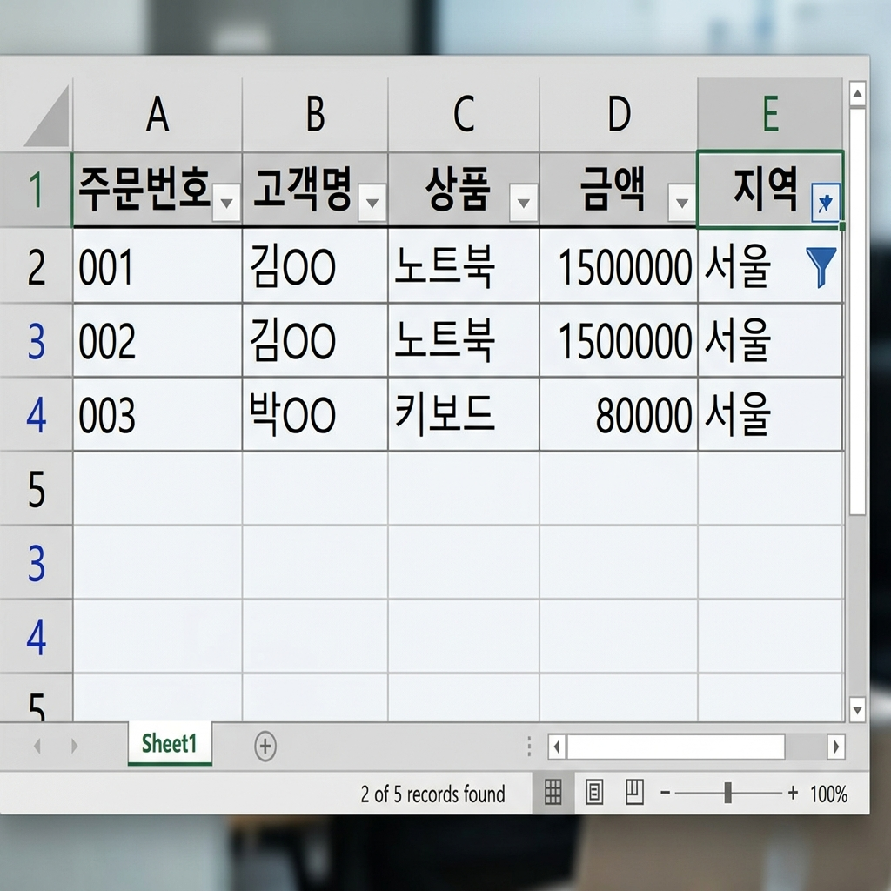

# 📌 14강: 데이터 정렬과 필터

> **핵심 포인트**: 대량 데이터를 원하는 기준으로 정렬하고, 자동 필터로 원하는 데이터만 추출합니다.

---

## 📖 이론 (20분)

### 정렬 (Sort)

데이터를 **특정 기준(열)**으로 순서를 재배치합니다.

| 정렬 유형 | 설명 | 예시 |
|----------|------|------|
| 오름차순 (A→Z) | 작은 값 → 큰 값 | 1,2,3... / 가,나,다... / A,B,C... |
| 내림차순 (Z→A) | 큰 값 → 작은 값 | 100,99,98... / 하,파,타... |

#### 한 열 기준 정렬 (간단)

1. 정렬할 열의 아무 셀 클릭
2. 홈 → 정렬 및 필터 → 오름차순/내림차순
3. 또는 데이터 탭 → A→Z / Z→A

> ⚠️ **절대 주의**: 정렬 전에 표 전체가 선택되어야 합니다! 한 열만 선택하면 그 열만 움직이고 나머지 데이터는 그대로여서 **데이터가 엉킵니다!**

#### 다중 기준 정렬

1. 데이터 영역의 아무 셀 클릭
2. 데이터 → **정렬** (대화상자)
3. "기준 추가"로 2차, 3차 정렬 기준 추가

```
예시: 부서별 오름차순 → 같은 부서 내에서 급여 내림차순

정렬 전:                정렬 후:
이름  부서  급여        이름  부서  급여
김철수 영업 3500       박지은 개발 4200  ← 개발부, 급여 높은 순
이영희 개발 3800       이영희 개발 3800
홍길동 영업 4000       홍길동 영업 4000  ← 영업부, 급여 높은 순
박지은 개발 4200       김철수 영업 3500
```

### 자동 필터 (AutoFilter) ⭐

표에서 **특정 조건에 맞는 행만** 표시하고 나머지는 숨깁니다.

#### 필터 켜기/끄기
- 데이터 탭 → **필터** 버튼 (또는 `Ctrl+Shift+L`)
- 제목 행에 ▼ 드롭다운 화살표가 나타남

```
필터 적용 전:           ▼ 클릭 후:              필터 적용 후:
┌──────┬──────┐        ☑ 전체 선택             ┌──────┬──────┐
│부서▼ │급여  │        ☑ 개발                  │부서▼ │급여  │
├──────┼──────┤        ☐ 영업   ← 체크해제!     ├──────┼──────┤
│개발  │3800  │        ☑ 인사                  │개발  │3800  │
│영업  │4000  │                                │인사  │3500  │
│인사  │3500  │        → "영업" 숨김            └──────┴──────┘
│개발  │4200  │                                  (영업 행이 사라짐!)
```

#### 필터 옵션

| 필터 유형 | 방법 | 설명 |
|----------|------|------|
| 값 선택 | 체크박스 | 원하는 값만 체크 |
| 텍스트 필터 | "포함", "시작 문자" 등 | 텍스트 조건 |
| 숫자 필터 | "보다 큼", "사이" 등 | 숫자 범위 조건 |
| 날짜 필터 | "이번 달", "지난 주" 등 | 기간 조건 |
| 색 기준 필터 | 셀 색/글꼴 색 | 조건부 서식과 연계! |

#### 필터 상태 확인

- 필터 적용 중: ▼ 아이콘이 **깔때기 모양 🔽**으로 변함
- 행 번호가 **파란색**으로 표시됨 (숨겨진 행이 있다는 뜻)
- 상태 표시줄: "X개 중 Y개 레코드를 찾음"

#### 필터 해제
- 방법 1: 깔때기 아이콘 클릭 → "필터 해제"
- 방법 2: 데이터 → 지우기
- 방법 3: `Ctrl+Shift+L` (필터 자체를 끔)

### 엑셀 표 (Table) 기능

데이터 범위를 **공식 표(Table)**로 변환하면 자동 필터가 기본 적용됩니다.

변환 방법: 데이터 범위 선택 → `Ctrl+T` → 확인

표의 장점:
- 자동 필터 + 자동 서식 (줄무늬)
- 행 추가 시 수식/서식 자동 확장
- 구조적 참조 가능 (고급)

### ⌨️ 이번 강의 필수 단축키

| 단축키 | 기능 |
|--------|------|
| `Ctrl+Shift+L` | 자동 필터 켜기/끄기 |
| `Ctrl+T` | 표(Table) 변환 |
| `Alt+↓` | 필터 드롭다운 열기 |

---

## 🔨 가이드 실습 (25분)

**📋 완성 결과 미리보기**:



### 실습 1: 쇼핑몰 주문 데이터 분석 (12분)

**목표**: 주문 데이터를 정렬하고 필터링하여 원하는 정보를 추출합니다.

1. **데이터 입력** (최소 15행):
   ```
        A       B        C        D         E
   1행  주문번호 고객명   상품     금액      지역
   2행  001     김하나   노트북   1500000   서울
   3행  002     이두리   마우스   35000     부산
   4행  003     박세현   키보드   80000     서울
   5행  004     최민수   모니터   450000    대구
   ...  (15행까지 다양한 데이터 입력)
   ```

2. **정렬 연습**:
   - 금액 기준 내림차순 정렬 → 가장 비싼 주문이 위로!
   - 다중 기준: 지역 오름차순 → 같은 지역 내 금액 내림차순

3. **자동 필터 적용**:
   - `Ctrl+Shift+L`로 필터 켜기
   - 지역 필터: "서울"만 선택 → 서울 주문만 표시
   - 금액 필터: 숫자 필터 → "보다 큼" → 100000 → 10만원 초과만
   - 필터 해제하여 전체 데이터 다시 보기

4. **표(Table) 변환**: `Ctrl+T` → 자동으로 줄무늬 서식 + 필터!

### 실습 2: 정렬 실수 체험하기 (8분)

**목표**: 정렬 주의사항을 직접 체험하고 올바른 방법을 익힙니다.

1. 간단한 3열×5행 표 만들기 (이름, 나이, 점수)
2. **잘못된 정렬**: B열(나이)만 선택 → 정렬 → 경고 메시지!
   - "현재 선택 영역으로 정렬" vs "선택을 확장하여 정렬"
   - "현재 선택 영역"을 선택하면 → 나이만 재배치되어 데이터 엉킴!
3. `Ctrl+Z`로 되돌리기
4. **올바른 정렬**: 표 안 아무 셀 클릭 → 데이터 → 정렬 → 안전!

### 실습 3: 엑셀 표(Table) 체험 (5분)

**목표**: 일반 범위와 표(Table)의 차이를 확인합니다.

1. 데이터 범위 선택 → `Ctrl+T` → 표 변환
2. 자동으로 적용되는 것 확인: 줄무늬, 필터, 제목행 서식
3. 행 하나를 추가해보세요 → 서식이 자동 확장!
4. 표 디자인 탭에서 다른 스타일 적용해보기

---

## 🎯 자율 실습 (25분)

[TOPIC_POOL.md](TOPIC_POOL.md)에서 마음에 드는 주제를 골라 자유롭게 도전해보세요!

**이번 강의 추천 주제**: 🟢 쇼핑몰 주문 데이터 분석, 🟡 도서 대출 관리

---

## ✅ 이번 강의 체크리스트

- [ ] 한 기준으로 오름차순/내림차순 정렬할 수 있다
- [ ] 다중 기준 정렬(1차→2차)을 할 수 있다
- [ ] 정렬 전 주의사항(전체 범위 선택)을 알고 있다
- [ ] 자동 필터를 켜고 끌 수 있다 (Ctrl+Shift+L)
- [ ] 값 선택, 숫자 필터 등 다양한 필터를 사용할 수 있다
- [ ] Ctrl+T로 표(Table) 변환을 할 수 있다

---

## 🔗 다음 강의

[15강: VLOOKUP과 XLOOKUP](../L15_VLOOKUP과_XLOOKUP/README.md) — 다른 표에서 데이터를 찾아오는 마법의 함수
